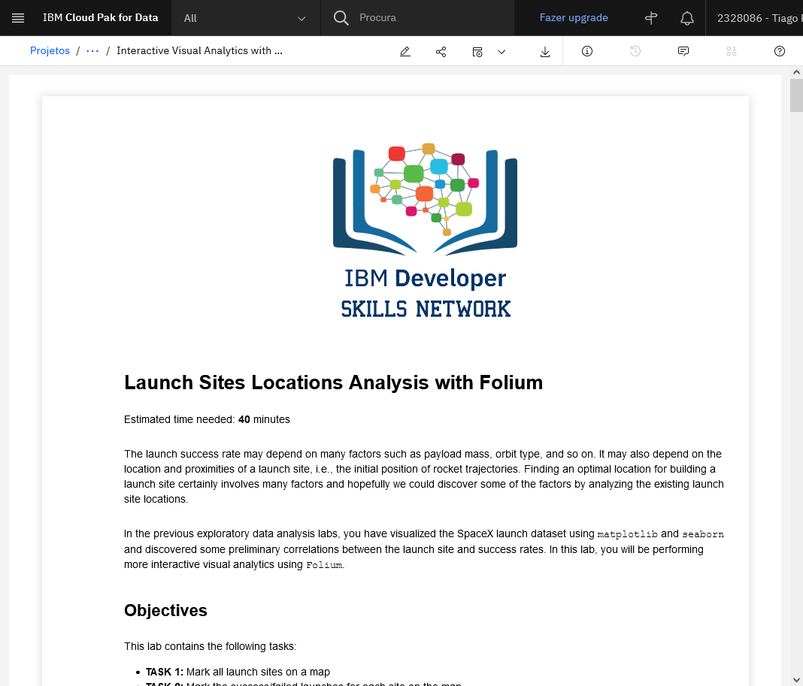
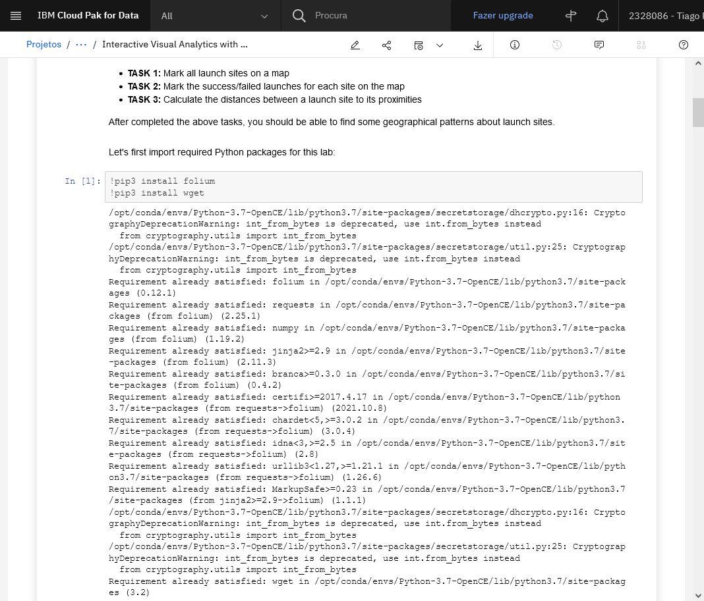
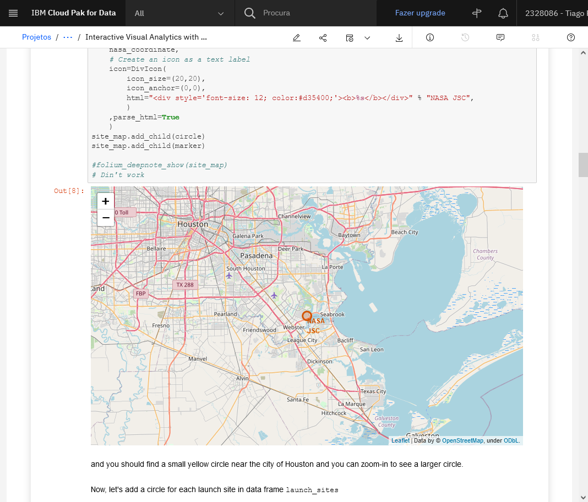
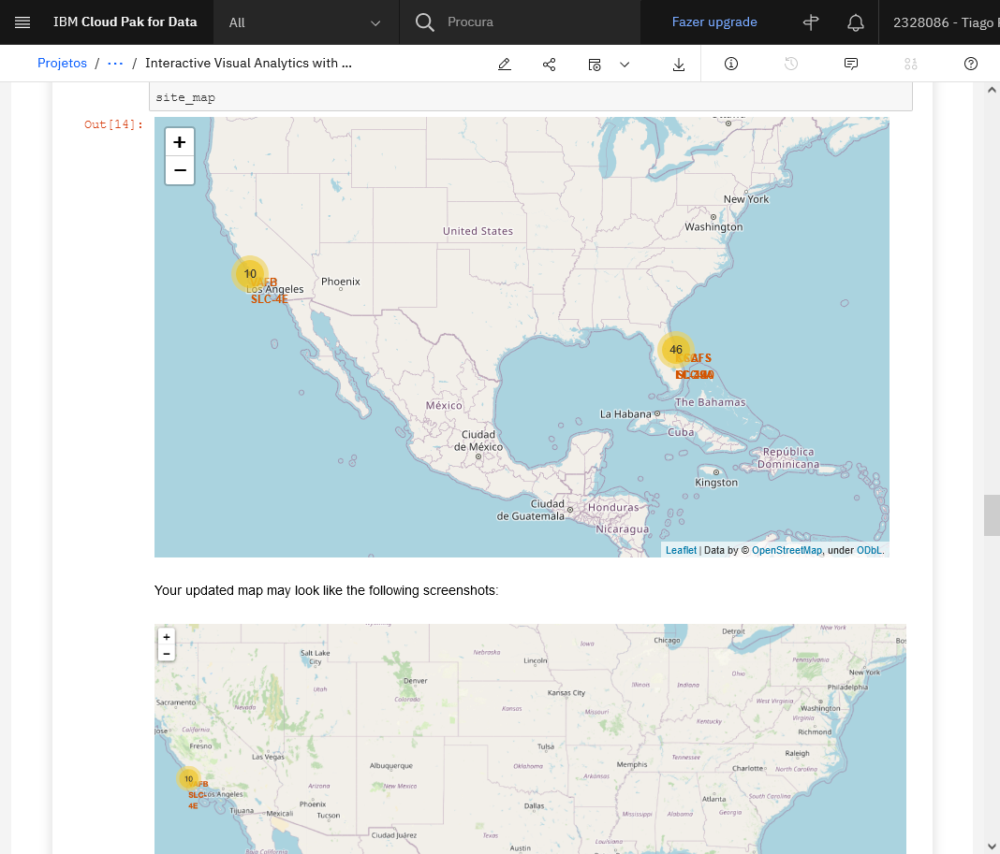
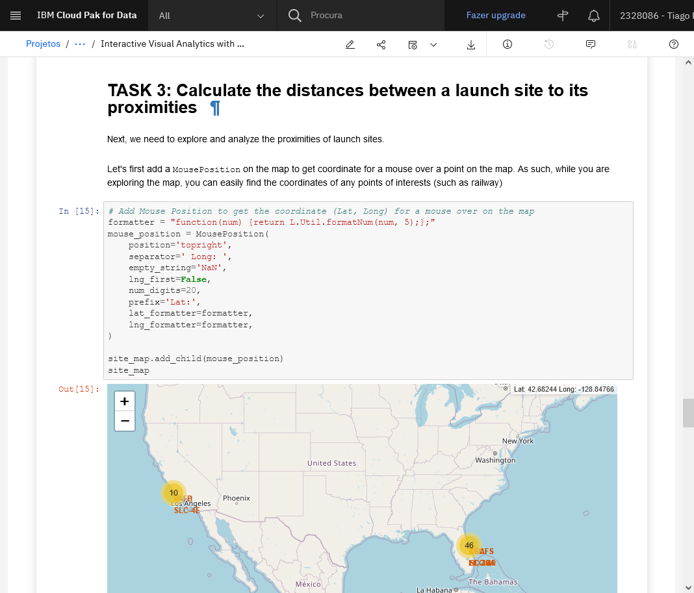
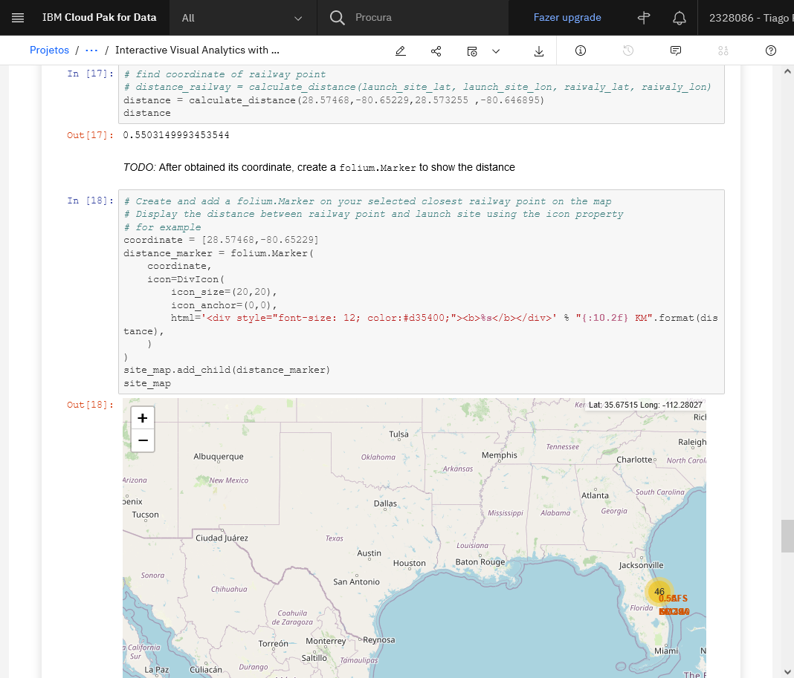
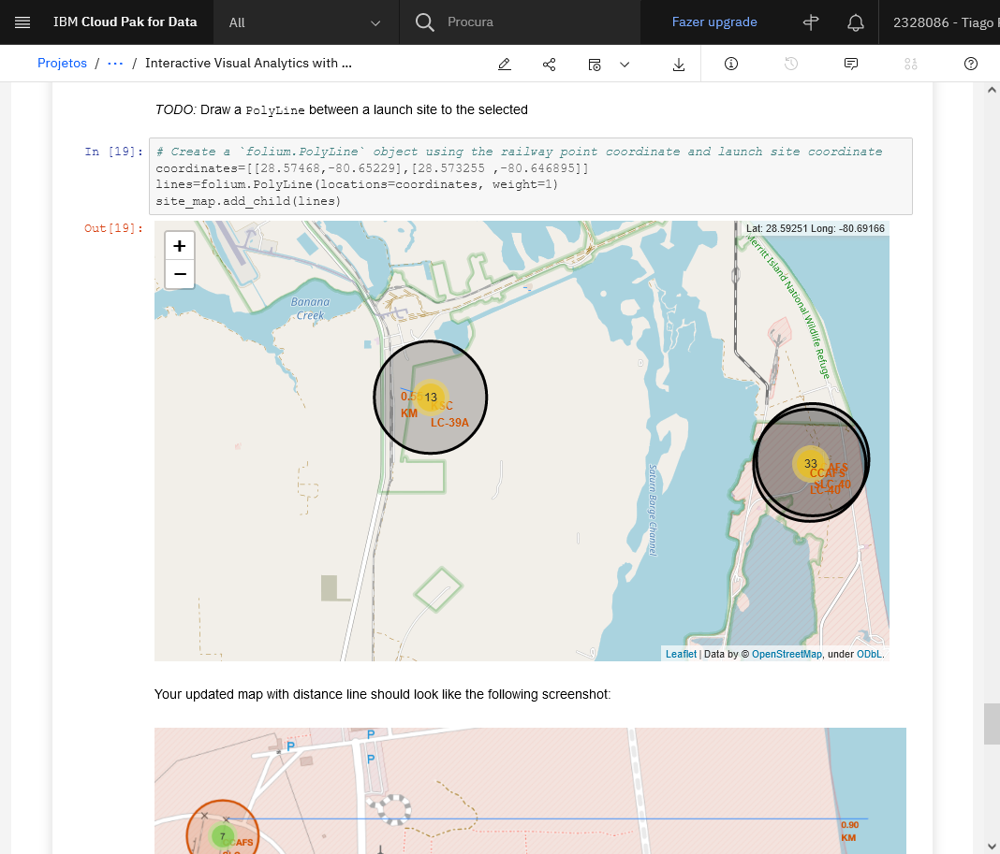
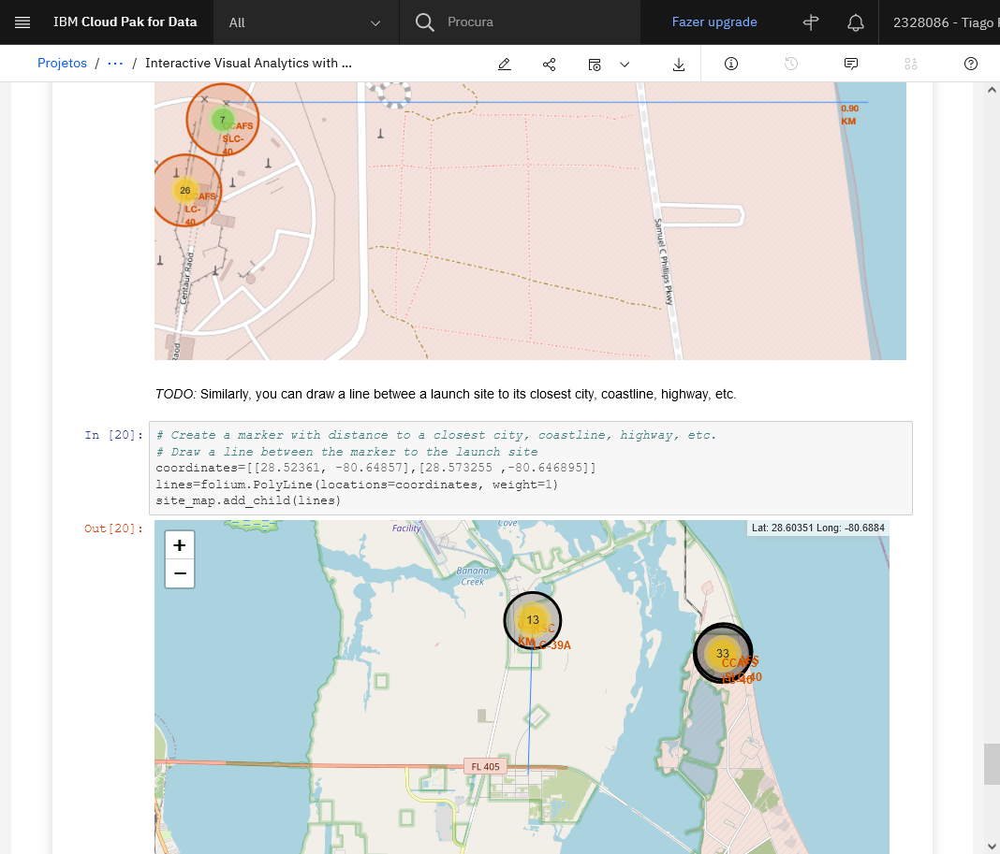
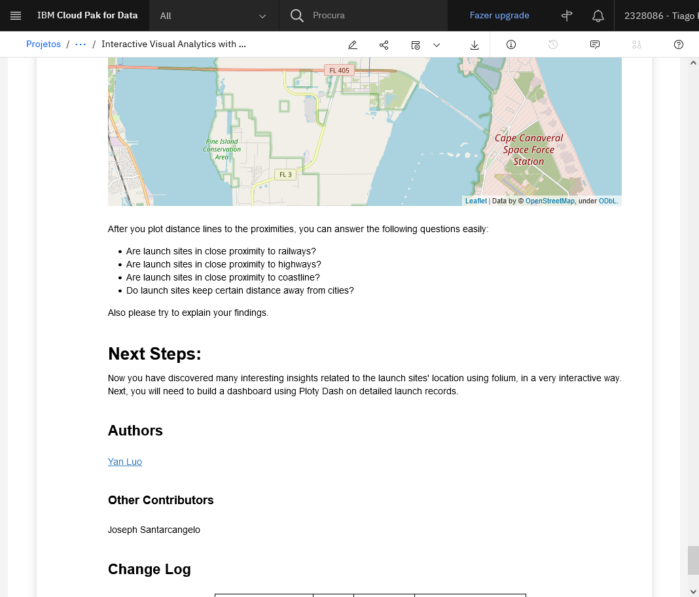

# Workaround

Due to "Make this Notebook Trusted to load map: File -> Trust Notebook" error
I decided to create this folder with prints from my notebook, otherwise it would
take ever more time to solve the exhibition problem.

